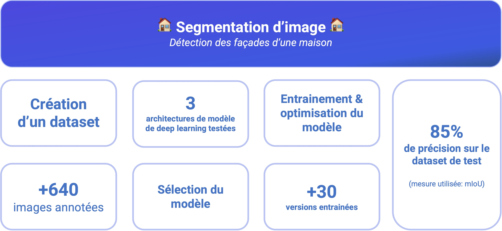

# Data Scientist

## Education
- Bootcamp, Data Science - Le Wagon (_Juillet 2022_)								       		
- Master, Finance - Edhec Business School (_Juin 2018_)	 			        		
- Licence, Mathématiques - Toulouse School of Economics (_Mai 2014_)

## Projets récents
### Développement d'un programme capable de délimiter la façade d'une maison sur une photo @ ParexLanko
#### _Technologies utilisées : Python, Pytorch, albumentations, Hugging Face, Numpy_

[Vidéo de démo du modèle](https://www.loom.com/share/f80fabccb75146aeb042374e20ada5b2?sid=ef034fda-362c-431f-a3c8-eed361733092)

- Création d'un dataset optimisé pour la segmentation d'images (+640 images annotées), en se concentrant sur la diversité, la qualité et la représentativité des images. 
- Recherche et sélection de modèles de deep learning adaptés à la problématique.
- Entraînement et optimisation des hyperparamètres du modèle afin de maximiser la précision de la segmentation (score obtenu : ~85% mIoU).
- Mise en place de data augmentation pour augmenter la robustesse du modèle face à différentes conditions de lumière, d'angle et de résolution.
- Développement d'un algorithme de traitement d'image pour appliquer de manière réaliste la texture sur la zone détourée.

### Entrainement d'un modèle de machine learning afin de prédire la durée de vie d'un avion de ligne @ Naveo Consulting
#### _Technologies utilisées : Scikit-Survival, Scipy, Pandas, Google Cloud Platform, Google Big Query_

- Collaboration avec des experts du secteur pour créer un dataset pertinent, intégrant les variables clés ayant une influence sur la durée de vie d'un avion.
- Prétraitement des données, incluant le nettoyage, le formatage et la gestion des valeurs manquantes, afin de garantir une qualité optimale pour l'entraînement des modèles.
- Entraînement de plusieurs modèles de machine learning (Random Forest, XGBoost et CatBoost) pour identifier les meilleures approches (Erreur moyenne obtenue : <1.8 ans).
- Mise en production du modèle et des algorithmes de prétraitement de données sur Google Cloud Platform. 
- Développement d'une interface web pour permettre au client d'utiliser facilement le modèle et d'exporter les résultats dans ses outils.

### Développement et mise en production d'un programme combinant un algorithme d'extraction d'image et un LLM @ Université PSL (Paris Sciences & Lettres)
#### _Technologies utilisées : OpenCV, HuggingFace, Mistral, LangChain, Numpy, PyTorch, AWS, docker_

- Conception et entraînement d'un modèle de classification capable de reconnaître différents graphiques (histogrammes, courbes, nuages de points) afin de les orienter vers des algorithmes d'extraction appropriés.
- Développement, avec OpenCV, d'un algorithme de computer vision pour extraire automatiquement les données d'un "Western blot" (graphique utilisé dans le recherche médicale).
- Extraction automatique des données de graphiques classiques (histogrammes, courbes) grâce à un modèle de deep learning (DePlot).
- Prompt engineering, avec Mistral et LangChain, pour générer automatiquement l'analyse des données extraites des graphiques.
- Mise en production du pipeline complet, incluant l'intégration avec le back-end (AWS) et la base de données du client (MongoDB).

## Experience
**Data Scientist Consultant @ Freelance (_Juillet 2023 - Aujourd'hui_)**
- Accompagnement de 5 entreprises dans la mise en œuvre de projets data, de l'étude du besoin à la mise en production.
- Développement de modèles prédictifs et d'algorithmes de machine learning.
- Création de tableaux de bord interactifs.
  
**Teacher Assistant @ Le Wagon (_Juillet 2022 - Février 2023_)**

**Analyste Financier @ ArcelorMittal Treasury (_Février 2020 - Juin 2023_)**

**Venture Capital Analyst @ Airbus Venture (_Septembre 2018 - Mars 2019_)**

